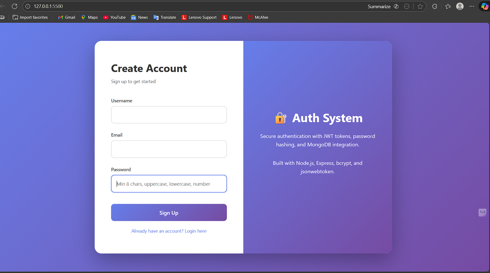
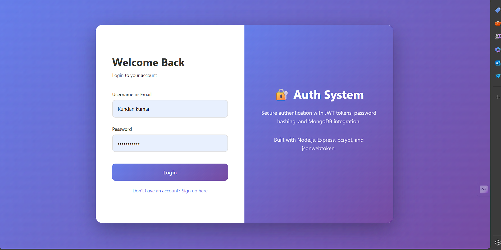

# User Authentication System

A secure user authentication system built with Node.js, Express, MongoDB, and JWT (JSON Web Tokens).
## Screenshots

### Main Page - User Registration


### Login Page


## Features

- User registration and login
- Password hashing with bcrypt
- JWT-based authentication
- MongoDB database integration
- CORS support
- Environment variable configuration

## Technologies Used

- **Node.js** - JavaScript runtime
- **Express.js** - Web application framework
- **MongoDB** - NoSQL database
- **Mongoose** - MongoDB object modeling
- **JWT (jsonwebtoken)** - Token-based authentication
- **bcrypt** - Password hashing
- **dotenv** - Environment variable management
- **CORS** - Cross-Origin Resource Sharing

## Prerequisites

Before running this project, make sure you have:

- Node.js (v14 or higher)
- MongoDB installed and running
- npm or yarn package manager

## Installation

1. Clone the repository:
```bash
git clone https://github.com/KUNDANIOS/user-auth-system-.git
cd user-auth-system-
```

2. Install dependencies:
```bash
npm install
```

3. Create a `.env` file in the root directory:
```env
JWT_SECRET=your-secret-key-change-in-production
JWT_EXPIRY=24h
MONGODB_URI=mongodb://localhost:27017/auth-system
PORT=5000
```

4. Update the configuration values:
   - Replace `JWT_SECRET` with a strong, unique secret key
   - Update `MONGODB_URI` with your MongoDB connection string
   - Adjust `PORT` if needed

5. Make sure MongoDB is running on your system

## Running the Application

Start the server:
```bash
npm start
```

For development with auto-restart:
```bash
npm run dev
```

The server will start on `http://localhost:5000` (or your specified PORT).

## Testing the Application

### Method 1: Using the HTML Interface
1. Open your browser and go to `http://localhost:5000`
2. You'll see the authentication interface
3. Try registering a new user and then logging in

### Method 2: Using API Testing Tools (Postman, Thunder Client, or cURL)

**Test Registration:**
```bash
curl -X POST http://localhost:5000/api/auth/register \
  -H "Content-Type: application/json" \
  -d '{"username":"testuser","email":"test@example.com","password":"Test123456"}'
```

**Test Login:**
```bash
curl -X POST http://localhost:5000/api/auth/login \
  -H "Content-Type: application/json" \
  -d '{"email":"test@example.com","password":"Test123456"}'
```

**Test Protected Route (use token from login response):**
```bash
curl -X GET http://localhost:5000/api/auth/profile \
  -H "Authorization: Bearer YOUR_JWT_TOKEN_HERE"
```

### Expected Responses

**Successful Registration:**
```json
{
  "message": "User registered successfully",
  "userId": "507f1f77bcf86cd799439011"
}
```

**Successful Login:**
```json
{
  "token": "eyJhbGciOiJIUzI1NiIsInR5cCI6IkpXVCJ9...",
  "user": {
    "id": "507f1f77bcf86cd799439011",
    "username": "testuser",
    "email": "test@example.com"
  }
}
```

## API Endpoints

### Authentication

#### Register User
```http
POST /api/auth/register
Content-Type: application/json

{
  "username": "string",
  "email": "string",
  "password": "string"
}
```

#### Login User
```http
POST /api/auth/login
Content-Type: application/json

{
  "email": "string",
  "password": "string"
}
```

#### Get User Profile (Protected)
```http
GET /api/auth/profile
Authorization: Bearer <token>
```

## Project Structure
```
user-auth-system/
├── node_modules/
├── .env
├── .gitignore
├── package.json
├── package-lock.json
├── server.js
├── index.html
└── README.md
```

## Security Features

- Passwords are hashed using bcrypt with salt rounds
- JWT tokens for stateless authentication
- Environment variables for sensitive data
- CORS configuration for cross-origin requests

## Environment Variables

| Variable | Description | Default |
|----------|-------------|---------|
| JWT_SECRET | Secret key for JWT signing | Required |
| JWT_EXPIRY | Token expiration time | 24h |
| MONGODB_URI | MongoDB connection string | Required |
| PORT | Server port number | 5000 |

## Contributing

1. Fork the repository
2. Create your feature branch (`git checkout -b feature/AmazingFeature`)
3. Commit your changes (`git commit -m 'Add some AmazingFeature'`)
4. Push to the branch (`git push origin feature/AmazingFeature`)
5. Open a Pull Request

## License

This project is licensed under the MIT License.

## Author

**KUNDANIOS**

## Acknowledgments

- Express.js documentation
- MongoDB documentation
- JWT.io for token debugging
- bcrypt library for secure password hashing